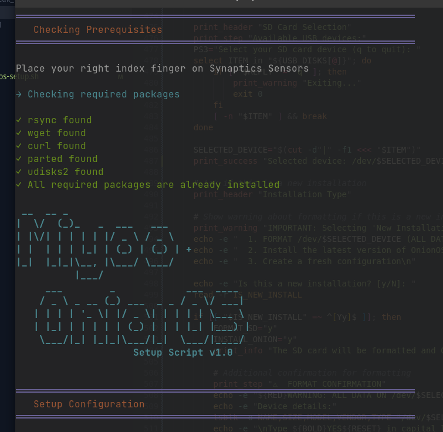

# Miyoo Plus OnionOS Setup Script

A bash script to automate the installation and setup of OnionOS, BIOS files, and ROM sets for Miyoo Plus devices.



## ⚠️ Important Notes

- **BIOS files and ROM sets are NOT included** with this script for legal reasons
- You must provide your own BIOS files and ROM sets
- Place them in the appropriate directories as described below before running the script
- ROM packs are completely optional - you can choose to install only OnionOS and add your own games later
- The script will format your SD card if you choose a new installation - **ALL DATA WILL BE ERASED**


## 🗂️ Required Directory Structure

```
.
├── BIOS/                     # Place your BIOS files here
├── sets/                     # ROM sets directory
│   ├── done-set-three_202501/
│   │   ├── Configs for Plus Model/
│   │   ├── Configs for V4 Model/
│   │   ├── Done Set 3/
│   │   │   └── Roms/
│   │   ├── Imgs (2D Box)/
│   │   ├── Imgs (2D Box and Screenshot)/
│   │   ├── Imgs (Miyoo Mix)/
│   │   ├── PS1 Addon for 256gb SD Cards/
│   │   └── Sensible Console Arrangement/
│   ├── tiny-best-set-go-games/
│   │   └── Roms/
│   ├── tiny-best-set-go-imgs-onion/
│   │   └── Roms/
│   ├── tiny-best-set-go-expansion-64-games/
│   │   └── Roms/
│   ├── tiny-best-set-go-expansion-64-imgs-onion/
│   │   └── Roms/
│   ├── tiny-best-set-go-expansion-128-games/
│   │   └── Roms/
│   └── tiny-best-set-go-expansion-128-imgs-onion/
│       └── Roms/
└── miyoo-onionos-setup.sh   # The setup script
```

## 🚀 Features

- Automated setup process with all choices collected at the beginning
- Safe SD card formatting with confirmation checks
- Automatic download and installation of the latest OnionOS version
- Installation of Easy Logo Tweak (automatically downloads latest version)
- BIOS files installation (optional)
- Optional ROM set installation with multiple choices:
  1. Done Set Three
     - Model-specific configurations (Plus/V4)
     - Optional PS1 games
     - Choice of artwork styles:
       - Miyoo Mix (Recommended)
       - 2D Box
       - 2D Box with Screenshots
  2. Tiny Best Set GO Options:
     - Main set only
     - Main + 64GB expansion
     - Main + 64GB + 128GB expansion
  - Or choose to skip ROM installation entirely and add your own games later
- Debug mode for detailed installation information (--debug flag)
- Safe device mounting and unmounting
- Progress indicators for all file operations

## 📋 Prerequisites

- Linux operating system
- Sudo access
- Package manager (apt, dnf, or pacman)
- Internet connection for downloading dependencies

The script will automatically check for and install the following required packages if missing:
  - `rsync`
  - `wget`
  - `curl`
  - `parted`
  - `udisks2`

## 🛠️ Usage

1. Insert your SD card into your PC
2. Clone or download this repository
3. Place your BIOS files in the `BIOS` directory
4. Place your ROM sets in the `sets` directory following the structure above
5. Make the script executable:
   ```bash
   chmod +x miyoo-onionos-setup.sh
   ```
6. Run the script:
   ```bash
   ./miyoo-onionos-setup.sh
   ```
   For detailed output:
   ```bash
   ./miyoo-onionos-setup.sh --debug
   ```

## 📝 Installation Process

The script will guide you through the following steps:

1. **Prerequisites Check**
   - Verifies required packages
   - Installs missing dependencies

2. **SD Card Selection**
   - Lists available USB devices
   - Helps identify your SD card

3. **Installation Type**
   - New Installation (formats SD card)
   - Update Existing Installation

4. **Component Selection**
   - OnionOS (required for new installations)
   - Easy Logo Tweak (optional)
   - BIOS files (optional)
   - ROM sets (optional - you can skip this and add your own games later)

5. **ROM Set Configuration**
   - Choice of ROM set package
   - Model-specific settings (for Done Set Three)
   - Artwork preferences

6. **Configuration Review**
   - Shows summary of selected options
   - Requires confirmation before proceeding

7. **Installation**
   - Formats SD card (if selected)
   - Downloads and installs components
   - Shows progress for all operations

## ⚙️ Device Support

- Miyoo Plus
- Miyoo Mini V4

## 🔒 Safety Features

- Confirmation required for formatting
- Device details shown before format
- Safe device ejection
- Automatic mount point detection
- Progress tracking for all file operations
- Debug mode for detailed operation information

## ⚖️ Legal Notice

This script does not include any copyrighted BIOS files or ROMs. Users must provide their own files and ensure they have the legal right to use them.

## 🤝 Contributing

Feel free to submit issues and enhancement requests! 

## External Links

- [OnionOS](https://github.com/OnionUI/Onion)
- [Easy Logo Tweak](https://github.com/schmurtzm/Miyoo-Mini-easy-logotweak)
- [Done Set Three](https://archive.org/details/done-set-three_202501)
- [Tiny Best Set GO](https://myrient.erista.me/files/Miscellaneous/Tiny%20Best%20Set%3A%20GO%21/)
- [ROMS Mega Thread](https://r-roms.github.io/)
